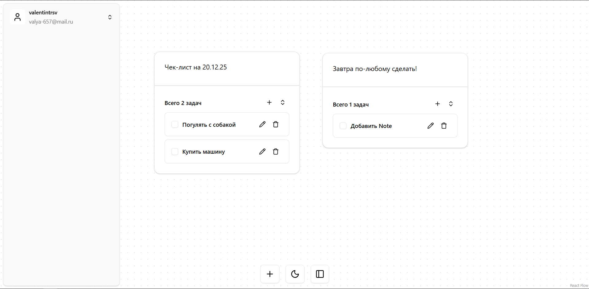

# Архитектура проекта “Трекер жизни”

Этот документ описывает архитектуру фронтенд‑проекта “Трекер жизни” (Life Tracker), реализованного на `React + TypeScript` в стиле **Feature-Sliced Design (FSD)**.

---

## Общая идея

Основная концепция — это настраиваемая панель управления (Dashboard), где пользователи могут создавать и организовывать различные виджеты для управления своими задачами и информацией:

- Задачи на день / неделю / месяц.
- Учёт бюджета.
- Контроль билетов.
- И другие блоки по мере развития проекта.

В терминах архитектуры:

- **Entities** — данные и доменные модели (`board`, `task`, `budget`, `ticket`, `user`).
- **Features** — пользовательские действия над сущностями (управление задачами, бюджетом, виджетами доски, drag&drop и т.д.).
- **Widgets** — готовые интерфейсные блоки (набор фич + сущности) вроде “Задачи на день”, “Бюджет” и т.п.
- **Pages** — страницы приложения (например, страница доски).
- **App** — точка входа, провайдеры, роутинг.
- **Shared** — общие компоненты и утилиты (кнопки, модалки, хуки, HTTP‑клиент).

---
## Первая версия продукта

1. Dashboard (Доска):
- Это основное рабочее пространство, реализованное с помощью библиотеки @xyflow/react.
- Представляет собой холст, на который можно добавлять виджеты.
- Виджеты можно свободно перемещать по холсту, создавая удобную для пользователя компоновку.
2. Виджеты (Nodes):
- Добавление: Пользователи могут добавлять новые виджеты на доску.
- Удаление: Любой виджет можно удалить с доски через контекстное меню (вызывается правой кнопкой мыши) или нажатием клавиши Delete.
- Настройки: У каждого виджета есть заголовок, который можно настроить.
3. Типы виджетов:
- Чек-лист (Todo):
- - Основной функциональный виджет на данный момент.
- - Позволяет создавать списки задач.
- - Функции:
- - - Добавление новых задач через диалоговое окно.
- - - Редактирование существующих задач.
- - - Удаление задач.
- - - Отметка задач как выполненных (задача становится серой и зачеркнутой).
- - Каждый экземпляр виджета "Чек-лист" имеет свой собственный, независимый список задач.
- Заметки (Note):
- - На данный момент это виджет-заглушка, который планируется реализовать в будущем.
4. Аутентификация и данные:
- В проекте реализована система аутентификации пользователей через Supabase.
- Все данные (доски, виджеты, задачи) привязаны к конкретному пользователю и сохраняются в базе данных.

